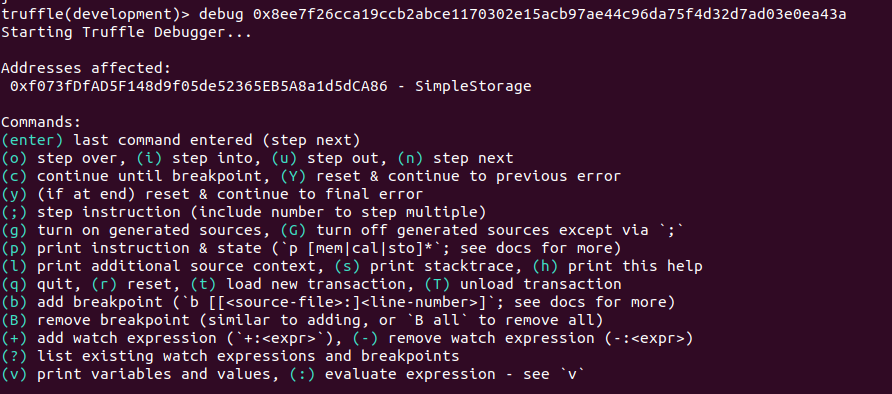
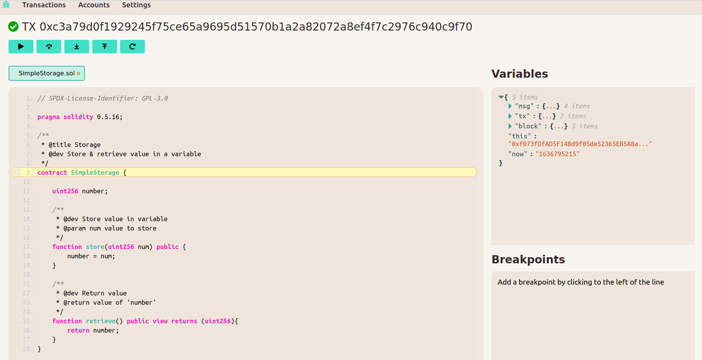

## Run Truffle Debugger CLI
1. ganache-cli
2. truffle console
3. (truffle) compile
4. (truffle) migrate
5. x = await SimpleStorage.deployed()
6. debug txHash

7. x.store(5)
8. +:number
9. i (run step by step)
10. r (reset all steps)

## Fetch External
``truffle debug txHash --network development --fetch-external``

## Run Visual Debugger
``truffle run debug start``
